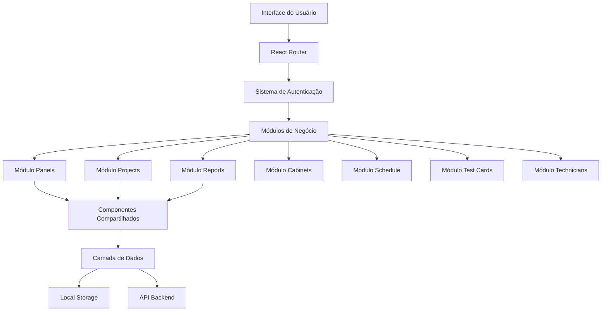

# 🏗️ Visão Geral da Arquitetura - LED Panel Manager

## 📋 Índice

- [Introdução](#introdução)
- [Arquitetura Geral](#arquitetura-geral)
- [Stack Tecnológico](#stack-tecnológico)
- [Estrutura de Módulos](#estrutura-de-módulos)
- [Fluxo de Dados](#fluxo-de-dados)
- [Padrões Arquiteturais](#padrões-arquiteturais)

## 🎯 Introdução

O LED Panel Manager foi projetado com uma arquitetura modular e escalável, seguindo as melhores práticas do desenvolvimento React moderno. A arquitetura prioriza:

- **Modularidade** - Cada funcionalidade em módulos independentes
- **Escalabilidade** - Fácil adição de novas features
- **Manutenibilidade** - Código limpo e bem organizado
- **Testabilidade** - Estrutura que facilita testes
- **Performance** - Otimizado para cargas de trabalho reais

## 🏗️ Arquitetura Geral



## 🛠️ Stack Tecnológico

### Frontend Core

- **React 18** - Biblioteca principal de UI
- **TypeScript** - Tipagem estática e melhor DX
- **Vite** - Build tool e dev server rápido

### Styling & UI

- **Tailwind CSS v4** - Framework CSS utility-first
- **Lucide React** - Biblioteca de ícones
- **Framer Motion** - Animações (planejado)

### State Management

- **React Hooks** - useState, useReducer, useContext
- **Custom Hooks** - Lógica de negócio encapsulada
- **Context API** - Estado global quando necessário

### Utilitários

- **Date-fns** - Manipulação de datas
- **React Hot Toast** - Sistema de notificações
- **@react-pdf/renderer** - Geração de PDF

## 📁 Estrutura de Módulos

Cada módulo segue uma estrutura consistente:

```
src/modules/[ModuleName]/
├── types/                    # Definições TypeScript
│   ├── [module].types.ts     # Tipos principais
│   └── index.ts              # Re-exports
├── hooks/                    # Custom hooks
│   ├── use[Module]Data.ts    # Hook principal de dados
│   └── index.ts              # Re-exports
├── components/               # Componentes específicos
│   ├── [Module]Card.tsx      # Componente de card
│   ├── [Module]Form.tsx      # Formulários
│   └── index.ts              # Re-exports
├── utils/                    # Utilitários e cálculos
│   ├── [module]Calculations.ts # Lógica de negócio
│   └── index.ts              # Re-exports
└── index.ts                  # Export principal do módulo
```

### Módulos Implementados

#### ✅ **Panels** (Completo)

- Gerenciamento de especificações de painéis LED
- Cálculos de potência, dimensões e densidade de pixels
- CRUD completo com interface

#### ✅ **Projects** (Completo)

- Gestão completa de projetos
- Tracking de progresso e orçamento
- Indicadores de risco e métricas

#### 🔄 **Reports** (Foundation)

- Geração de relatórios em PDF
- Templates customizáveis
- Relatórios comerciais e técnicos

#### ⏳ **Test Cards** (Planejado)

- Gerador de cartões de teste
- Templates por tipo de painel
- QR codes para acesso mobile

#### ⏳ **Auth** (Planejado)

- Sistema de autenticação JWT
- Controle de acesso granular
- Multi-tenancy

## 🔄 Fluxo de Dados

### 1. Carregamento Inicial

```typescript
App.tsx → AuthProvider → ModuleRouter → Module → Hook → Data
```

### 2. Interação do Usuário

```typescript
Component → Event Handler → Hook → State Update → Re-render
```

### 3. Persistência de Dados

```typescript
Hook → Validation → Local Storage / API → State Update
```

## 🎨 Padrões Arquiteturais

### 1. **Compound Components**

Componentes relacionados agrupados para melhor UX:

```typescript
<PanelCard>
  <PanelCard.Header />
  <PanelCard.Specs />
  <PanelCard.Actions />
</PanelCard>
```

### 2. **Custom Hooks Pattern**

Lógica de negócio encapsulada em hooks reutilizáveis:

```typescript
const { panels, loading, createPanel, updatePanel } = usePanelData();
```

### 3. **Provider Pattern**

Estado global gerenciado via Context API:

```typescript
<AuthProvider>
  <ThemeProvider>
    <App />
  </ThemeProvider>
</AuthProvider>
```

### 4. **Repository Pattern**

Abstração da camada de dados:

```typescript
// hooks/usePanelData.ts
const panelRepository = {
  getAll: () => Promise<Panel[]>,
  create: (panel: Panel) => Promise<Panel>,
  update: (id: string, panel: Partial<Panel>) => Promise<Panel>,
};
```

## 🔐 Segurança e Isolamento

### Multi-tenancy

- Isolamento completo de dados por usuário
- Middleware de autorização em todas as rotas
- Validação de permissões por módulo

### Validação de Dados

- Validação no frontend (UX)
- Validação no backend (segurança)
- Tipos TypeScript para prevenção de bugs

## 📈 Performance e Otimização

### Code Splitting

```typescript
const Reports = lazy(() => import("./modules/Reports"));
```

### Memoização

```typescript
const expensiveCalculation = useMemo(
  () => calculatePanelMetrics(panel),
  [panel]
);
```

### Virtual Scrolling (Planejado)

Para listas grandes de painéis e projetos.

## 🔮 Evolução da Arquitetura

### Fase Atual (v1.0)

- Arquitetura modular estabelecida
- Módulos core implementados
- Foundation para expansão

### Próxima Fase (v2.0)

- Sistema de autenticação completo
- Multi-tenancy com isolamento de dados
- API backend integrada

### Futuro (v3.0)

- Arquitetura de microsserviços
- Cache distribuído
- Real-time collaboration

---

**Referências:**

- [Modular Design](./modular-design.md)
- [Multi-tenant Architecture](./multi-tenant.md)
- [Design Patterns](./design-patterns.md)
